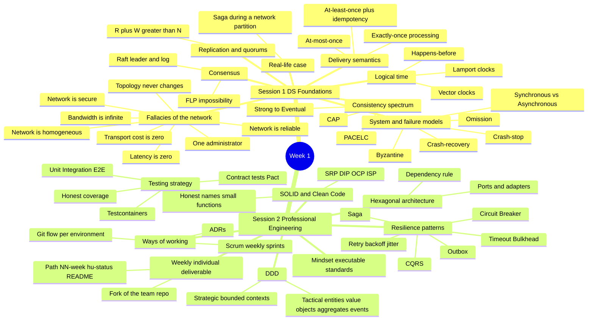

# 🧠 Mind Map — Distributed Systems (Week 1)
**CORHUILA · Systems Engineering · 2026-B**

---

## Diagram (Mermaid)

> If your Markdown viewer supports Mermaid (VS Code, Obsidian, GitHub), this block renders as a visual mind map.

---

## Detailed outline (in case your viewer doesn't render Mermaid)

### 🟢 Session 1 — Distributed systems: models, time, consistency and trade-offs

- **What really changes when you cross the network**
  - You lose: shared memory/state, a single clock, all-or-nothing failure
  - The 8 fallacies: the network is reliable, latency is zero, bandwidth is infinite, the network is secure, topology doesn't change, there is one administrator, transport cost is zero, the network is homogeneous — design assuming the opposite of each

- **System and failure models**
  - Timing: synchronous (bounded delays) vs asynchronous (no bounds, the realistic model for the internet)
  - Failure models, easiest to hardest: crash-stop → crash-recovery → omission (dropped messages) → Byzantine (arbitrary/malicious)
  - Most business systems design for crash-recovery + omission over an asynchronous network

- **Time is not global: logical clocks**
  - You cannot trust wall-clock time across nodes
  - Ordering comes from causality: Lamport's happens-before (→)
  - Lamport clocks give a total order consistent with causality, but do not prove direct causality — vector clocks are needed for that

- **The consistency spectrum: CAP and PACELC**
  - Consistency is a spectrum, not boolean: linearizable/strong → sequential → causal → eventual
  - CAP: under a partition, choose C (consistency) or A (availability)
  - PACELC: if partitioned, C vs A; else, latency vs consistency
  - Examples: money/inventory → strong; user profile/catalog → causal; metrics/counters → eventual

- **Replication, partitioning and quorums**
  - Replication = availability/reads; partitioning = scaling data
  - Quorum: with N replicas, R + W > N guarantees a read overlaps the latest write

- **Consensus**
  - Getting nodes to agree on one value/order despite failures (leader election, replicated logs)
  - FLP impossibility: in a purely asynchronous system with even one crash, no algorithm guarantees consensus in bounded time → real systems use timeouts/randomization
  - Raft: a leader replicates an append-only log to followers; an entry is committed once a majority acknowledges it

- **Communication and delivery semantics**
  - Synchronous (REST/gRPC) couples caller and callee in time; asynchronous (Kafka/RabbitMQ) decouples them at the cost of eventual consistency
  - Guarantees: at-most-once (may lose), at-least-once (may duplicate → requires idempotency), exactly-once (only as an end-to-end illusion via at-least-once delivery + idempotency key + deduplication)

- **Real-life case: "Place order" during a network partition**
  - Orders must decrement Inventory and charge Payments; the network partitions mid-request
  - Correct approach: inventory decrement is money-like → strong consistency; do NOT block waiting on Payments; use a Saga (reserve → charge → confirm, with compensation on failure); the charge call is at-least-once → needs an idempotency key; tell the user the truth (pending state) instead of a lie or a spinner

- **How the course works**
  - The team builds one real distributed system all semester, shipped as MVP1 → MVP2 → MVP3 across weekly sprints, with no exams

---

### 🔵 Session 2 — Professional engineering foundations for distributed systems

- **The governing mindset: executable standards**
  - Quality is mechanical, not aspirational: if a standard matters, it must fail the build when violated
  - Course rule: "MVP" reduces scope, never standards

- **DDD — strategic and tactical**
  - Strategic: split the system into bounded contexts, each with its own ubiquitous language; in distributed systems, a bounded context is a natural microservice boundary
  - Tactical: entities (identity + lifecycle), value objects (immutable), aggregates (the only consistency/mutation boundary), domain events (immutable, past tense)

- **Hexagonal architecture (ports & adapters)**
  - The core (domain + application/use-cases) must not know how it's driven or what it drives
  - Everything I/O crosses a port implemented by an adapter
  - Dependency rule: adapters → application → domain, never inward-out
  - Smell test for a broken hexagon: a domain file that imports a driver/ORM, or a controller that runs raw SQL

- **SOLID and Clean Code, applied**
  - SRP (one reason to change per module), DIP (depend on ports, inject adapters), OCP/ISP (small, specific ports)
  - Clean Code: honest names, small functions, no dead TODO/FIXME, explicit error handling

- **Resilience patterns**
  - Circuit Breaker: stop hammering a failing dependency
  - Retry + backoff + jitter: transient errors without retry storms
  - Timeout/Bulkhead: bound waiting, isolate pools
  - Saga: consistency across services without distributed transactions (compensations)
  - Outbox: publish an event and commit DB state atomically (no lost events)
  - CQRS: separate write model (commands) from read model (queries)

- **Testing strategy**
  - Test at the cheapest level that gives confidence: unit + integration + e2e per feature
  - A coverage floor with honest reporting (declared coverage may never exceed measured)
  - Contract tests (Pact) protect producer/consumer compatibility; testcontainers spin a real DB in integration tests

- **Ways of working: Scrum + Git flow + ADRs**
  - Weekly sprints over a prioritized backlog of user stories with testable acceptance criteria
  - DoD = implemented and tested, criteria met, security for critical risks, docs updated, validated at runtime
  - Branch model: three long-lived environment branches (develop → qa → main); for each user story, cut a child branch from that environment and open a PR back to the same environment, repeating for each environment

- **Your weekly individual deliverable (the fork)**
  - The team builds together, but each student proves individual contribution every week in their fork of the group repo
  - Exact path: `NN-week/hu-status/README.md` (a structured report: CONFIG, the HU worked, evidence links, compliance checklist)
  - The profile repo `username/username` must carry the CONFIG block (FULL_NAME, GITHUB_USER) — without a correct match, the automation cannot attribute the work

---

## 🔗 How the two sessions connect

Session 1 provides the **conceptual framework** (why distributed systems fail, how to reason about time/consistency/delivery) and Session 2 provides the **engineering tools** to build the semester project applying that framework from day one: resilience patterns (Saga, Outbox, Circuit Breaker) are the concrete implementation of the consistency and delivery decisions discussed in Session 1.
