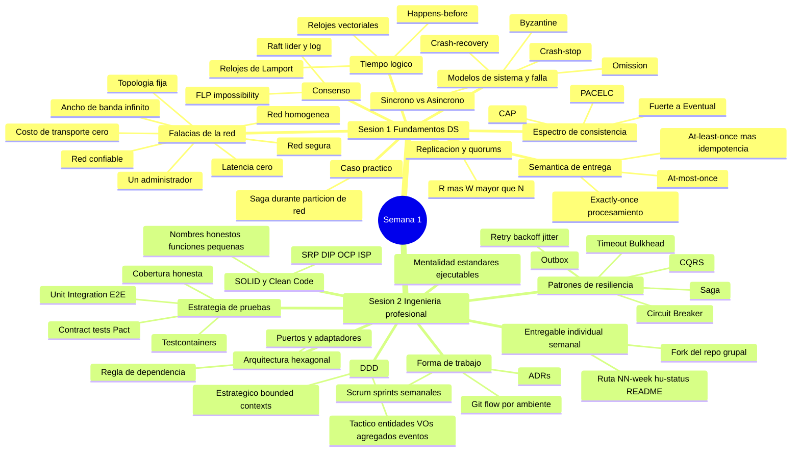

# 🧠 Mapa mental — Sistemas Distribuidos (Semana 1)
**CORHUILA · Ingeniería de Sistemas · 2026-B**

---

## Diagrama (Mermaid)

> Si tu visor de Markdown soporta Mermaid (VS Code, Obsidian, GitHub), este bloque se renderiza como mapa mental visual.

---

## Esquema detallado (por si tu visor no renderiza Mermaid)

### 🟢 Sesión 1 — Sistemas distribuidos: modelos, tiempo, consistencia y trade-offs

- **Qué cambia al cruzar la red**
  - Pierdes: memoria compartida, un reloj único, fallo "todo o nada"
  - Las 8 falacias: red confiable, latencia cero, ancho de banda infinito, red segura, topología fija, un solo administrador, costo de transporte cero, red homogénea — diseña asumiendo lo contrario de cada una

- **Modelos de sistema y de falla**
  - Timing: síncrono (retardos acotados) vs asíncrono (sin cotas, modelo real de internet)
  - Fallas de más fácil a más difícil: crash-stop → crash-recovery → omission (mensajes perdidos) → Byzantine (arbitrario/malicioso)
  - La mayoría de sistemas de negocio diseñan para crash-recovery + omission sobre red asíncrona

- **El tiempo no es global: relojes lógicos**
  - No confiar en el reloj de pared entre nodos
  - Orden viene de la causalidad: happens-before de Lamport (→)
  - Relojes de Lamport dan orden total consistente con causalidad, pero no prueban causalidad directa — para eso se necesitan relojes vectoriales

- **Espectro de consistencia: CAP y PACELC**
  - Consistencia no es booleana: fuerte/linealizable → secuencial → causal → eventual
  - CAP: ante partición, elegir C (consistencia) o A (disponibilidad)
  - PACELC: si hay partición, C vs A; si no, latencia vs consistencia
  - Ejemplos: dinero/inventario → fuerte; perfil/catálogo → causal; métricas/contadores → eventual

- **Replicación, particionamiento y quorums**
  - Replicación = disponibilidad/lecturas; particionamiento = escalar datos
  - Quorum: con N réplicas, R + W > N garantiza que una lectura vea la última escritura

- **Consenso**
  - Ponerse de acuerdo entre nodos pese a fallas (elección de líder, logs replicados)
  - FLP: en sistema puramente asíncrono con una sola falla, no hay garantía de consenso en tiempo acotado → se usan timeouts/aleatoriedad
  - Raft: un líder replica un log a followers; una entrada se compromete cuando la mayoría confirma

- **Comunicación y semántica de entrega**
  - Síncrono (REST/gRPC) acopla en el tiempo; asíncrono (Kafka/RabbitMQ) desacopla, a costo de consistencia eventual
  - Garantías: at-most-once (puede perder), at-least-once (puede duplicar → exige idempotencia), exactly-once (solo como ilusión: entrega at-least-once + clave de idempotencia + deduplicación)

- **Caso práctico: "Place order" durante partición**
  - Orders debe descontar Inventory y cobrar en Payments; la red se particiona a mitad del proceso
  - Enfoque correcto: inventario = consistencia fuerte; no bloquear esperando a Payments; usar Saga (reservar → cobrar → confirmar, con compensación si falla); el cobro es at-least-once → necesita idempotencia; comunicar estado real al usuario (pendiente) en vez de simular éxito

- **Cómo funciona el curso**
  - Se construye un sistema distribuido real en equipo, por releases (MVP1 → MVP2 → MVP3), en sprints semanales, sin exámenes

---

### 🔵 Sesión 2 — Fundamentos de ingeniería profesional para sistemas distribuidos

- **Mentalidad: estándares ejecutables**
  - La calidad es mecánica, no aspiracional: si una regla importa, debe romper el build cuando se viole
  - Regla del curso: "MVP" reduce alcance, nunca estándares

- **DDD — estratégico y táctico**
  - Estratégico: bounded contexts con su propio lenguaje ubicuo; en sistemas distribuidos, un bounded context es un límite natural de microservicio
  - Táctico: entidades (identidad + ciclo de vida), value objects (inmutables), agregados (única frontera de consistencia/mutación), domain events (inmutables, en pasado)

- **Arquitectura hexagonal (puertos y adaptadores)**
  - El núcleo (dominio + casos de uso) no sabe cómo lo invocan ni qué invoca él
  - Todo I/O cruza un puerto implementado por un adaptador
  - Regla de dependencia: adaptadores → aplicación → dominio, nunca al revés
  - Señal de alerta: un archivo de dominio que importa un driver/ORM, o un controlador que ejecuta SQL directo

- **SOLID y Clean Code aplicados**
  - SRP (una razón de cambio por módulo), DIP (depender de puertos, inyectar adaptadores), OCP/ISP (puertos pequeños y específicos)
  - Clean Code: nombres honestos, funciones pequeñas, sin TODO/FIXME muertos, manejo explícito de errores

- **Patrones de resiliencia**
  - Circuit Breaker: dejar de golpear una dependencia caída
  - Retry + backoff + jitter: errores transitorios sin tormentas de reintentos
  - Timeout/Bulkhead: acotar esperas y aislar pools
  - Saga: consistencia entre servicios sin transacciones distribuidas (con compensaciones)
  - Outbox: publicar un evento y confirmar en BD de forma atómica (sin eventos perdidos)
  - CQRS: separar modelo de escritura (comandos) del de lectura (consultas)

- **Estrategia de pruebas**
  - Probar en el nivel más barato que dé confianza: unit + integration + e2e por cada feature
  - Piso de cobertura y reporte honesto (la cobertura declarada nunca puede superar la medida)
  - Contract tests (Pact) para compatibilidad productor/consumidor; testcontainers para BD real en pruebas de integración

- **Forma de trabajo: Scrum + Git flow + ADRs**
  - Sprints semanales sobre un backlog priorizado de historias de usuario con criterios de aceptación verificables
  - DoD = implementado y probado, criterios cumplidos, seguridad revisada, documentación actualizada, validado en tiempo de ejecución
  - Modelo de ramas: tres ramas de ambiente de larga vida (develop → qa → main); por cada historia se crea una rama hija del ambiente y un PR de vuelta al mismo ambiente, repitiendo el proceso para cada ambiente

- **Entregable individual semanal (el fork)**
  - El equipo construye junto, pero cada estudiante prueba su contribución individual cada semana en su fork del repo grupal
  - Ruta exacta: `NN-week/hu-status/README.md` (reporte estructurado: CONFIG, la historia trabajada, enlaces de evidencia, checklist de cumplimiento)
  - El repo de perfil `username/username` debe llevar el bloque CONFIG (FULL_NAME, GITHUB_USER) — sin esa coincidencia, la automatización no atribuye el trabajo

---

## 🔗 Conexión entre ambas sesiones

La Sesión 1 da el **marco conceptual** (por qué falla lo distribuido, cómo pensar tiempo/consistencia/entrega) y la Sesión 2 da las **herramientas de ingeniería** para construir el proyecto del semestre aplicando ese marco desde el día uno: los patrones de resiliencia (Saga, Outbox, Circuit Breaker) son la forma concreta de implementar las decisiones de consistencia y entrega discutidas en la Sesión 1.
